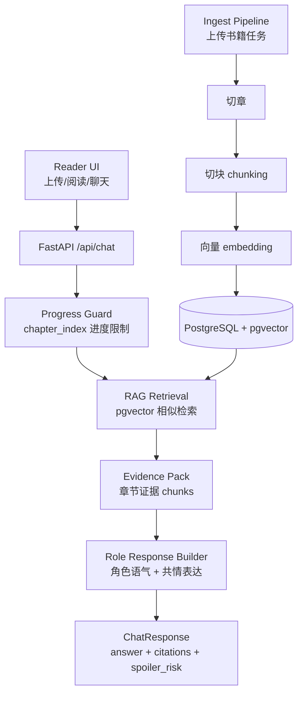

# StoryVerse RAG 讲解（新手版）

版本：v0.2（对应当前代码）  
日期：2026-04-21  
适用对象：第一次做 RAG、想做“角色扮演阅读”的开发者

## 1. 先用一句话理解你现在的 RAG

你这个项目里的 RAG 不是“百科问答型”，而是“剧情陪读型”：

`读者问题 -> 在已读章节里找证据 -> 让角色按人设说话 -> 返回引用`

核心目标有 3 个：
- 不胡编
- 不剧透
- 不出戏（角色人格尽量稳定）

## 2. 分层图（你要的层次图）



## 3. 你当前代码里，每层在哪里

### 3.1 数据层（存什么）
- `books`：书籍元信息
- `chapters`：章节原文
- `chapter_chunks`：检索粒度文本块 + 向量

对应模型：
- `backend/app/models/book.py`

关键点：
- `ChapterChunk.embedding` 是 `Vector(1536)`，这就是向量检索基础。

### 3.2 建索引层（怎么把书变成可检索）
- 入口任务：`books.ingest`
- 会做：解码文本 -> 切章 -> 切块 -> 向量化 -> 入库

对应代码：
- `backend/app/tasks/ingest.py`
- `backend/app/services/chunking.py`
- `backend/app/services/embedding.py`

补充：
- 你还可以用 `POST /api/books/{book_id}/embed` 对旧书补建向量索引。

### 3.3 检索层（怎么找证据）
- 根据用户问题生成 query embedding
- 只在 `chapter_index <= 用户进度` 的 chunks 内检索
- 按 cosine distance 排序取 top_k

对应代码：
- `backend/app/services/rag.py`

### 3.4 生成层（怎么“像角色”回答）
- 目前是 MVP：`角色风格模板 + 共情开场 + 证据摘要`
- 返回 `answer + citations + spoiler_risk`

对应代码：
- `backend/app/api/routes/chat.py`
- `backend/app/schemas/chat.py`

## 4. 一次请求到底发生了什么（按顺序）

以这个请求为例：

```json
{
  "book_id": "xxx",
  "role_name": "林黛玉",
  "message": "我觉得很难受，宝玉为什么总让我心乱？",
  "chapter_index": 20
}
```

系统流程：
1. API 收到 `/api/chat` 请求。
2. 检查 `book_id` 是否存在。
3. 用 `chapter_index=20` 作为检索上限，只允许查前 20 章。
4. 对问题做 embedding。
5. 到 `chapter_chunks` 里做向量相似度检索。
6. 拿到 top_k 证据，整理成 citations。
7. 用角色风格规则组织回答文本。
8. 返回结果，`spoiler_risk` 标为 `low (progress-guarded)`。

## 5. 为什么你这个 RAG 能“防剧透”

防剧透不是靠模型“自觉”，而是靠检索层硬限制：

- 你读到第 20 章，就只能检索 `chapter_index <= 20` 的证据。
- 模型没有未来证据可用，剧透概率会明显下降。

这叫“数据层防剧透”，比“提示词提醒别剧透”更可靠。

## 6. 为什么现在还会感觉“有点机械”

因为当前生成层是 MVP 版本：
- 有角色风格，但还是模板化
- 没有接真实 LLM 的“语言润色与情绪延展”
- 没有关系图谱驱动的动态人格状态

这不是方向错，而是你已经完成了最难的“可控链路”第一步。

## 7. 你现在可以直接用的接口

### 7.1 对旧书补向量

```powershell
Invoke-RestMethod -Uri "http://localhost:8000/api/books/<book_id>/embed" -Method Post
```

### 7.2 查看任务状态

```powershell
Invoke-RestMethod -Uri "http://localhost:8000/api/books/tasks/<task_id>" -Method Get
```

### 7.3 角色聊天（带进度）

```powershell
$payload = @{
  book_id = "<book_id>"
  role_name = "林黛玉"
  message = "我觉得很难受，宝玉为什么总让我心乱？"
  chapter_index = 20
} | ConvertTo-Json -Compress

Invoke-RestMethod -Uri "http://localhost:8000/api/chat" `
  -Method Post `
  -ContentType "application/json; charset=utf-8" `
  -Body $payload
```

## 8. 常见问题（你现在最可能遇到的）

### Q1：为什么有时 `citations` 为空？
- 常见原因是旧数据还没做 embed 回填。
- 先调用 `POST /api/books/{book_id}/embed`。
- 另一个原因是 worker 没重启，跑的是旧任务代码。

### Q2：为什么终端里中文看起来乱码？
- 这是 PowerShell 输出编码问题，不一定是接口内容错误。
- 先用 `Invoke-RestMethod`，并确保 JSON body 是 UTF-8。

### Q3：我已经回填了，但检索质量一般怎么办？
- 先调 `rag_chunk_size`、`rag_chunk_overlap`、`rag_top_k`。
- 后续把 `embedding.py` 换成真实 embedding API（接口保持不变）。

## 9. 下一步升级路线（按性价比排序）

1. 接真实 LLM 生成器，替换模板回答层。  
2. 引入角色卡约束和二次校验，降低人设漂移。  
3. 接关系图谱状态，做“章节推进 -> 人物关系变化 -> 回答变化”。  
4. 加会话记忆层，让角色能持续接住读者情绪。  

---

如果你愿意，我可以在下一步把这份文档再补两张图：
- 一张“防剧透机制图”
- 一张“人设守门器流程图”
