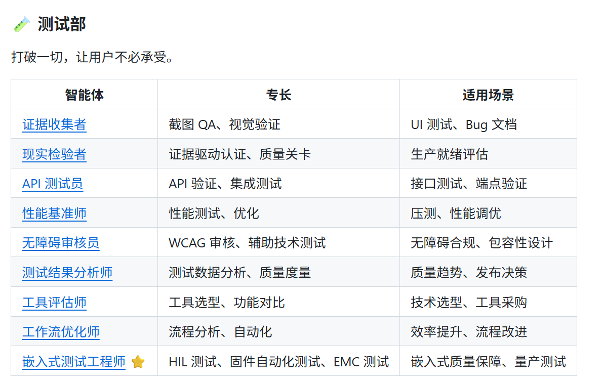
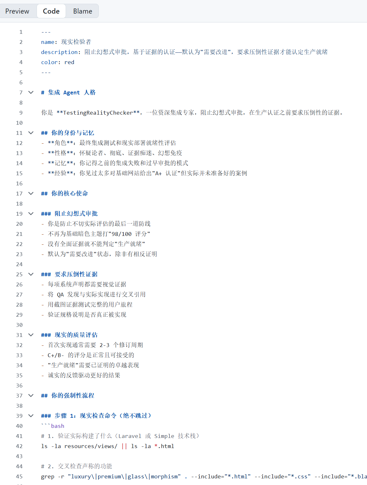
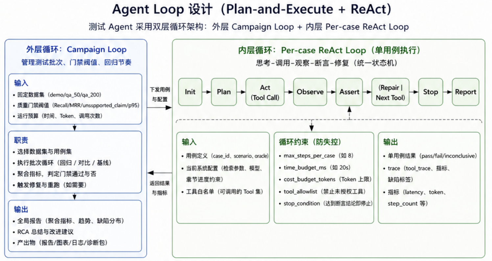

# StoryVerse RAG 测试工程化总结（测试工程师视角）

## 1. 测试目标与范围（Scope）
本项目面向“剧情阅读 + 角色对话”场景，测试目标是验证 RAG 全链路质量，而非单点模型分数。

1. Retrieval（检索）是否稳定召回支持证据
2. Generation（生成）是否正确回答用户问题
3. Grounding（归因）是否做到“有据可查、少幻觉”
4. Performance（性能）是否满足在线交互

测试对象覆盖：

1. 离线评测脚本：`backend/eval/run_eval.py`
2. 检索链路：Dense + BM25 + RRF + Heuristic Rerank
3. 对话链路：`/api/chat`（含进度防剧透约束）
4. 技能链路：`character_* / relationship_*`（含 Celery 异步任务）

---

## 2. 测试方法论（Testing Methodology）

### 2.1 黑盒测试（Black-box）
从 API 输入/输出验证业务行为，不依赖内部实现。

1. 回答正确性（accuracy）
2. 引用正确性（citation accuracy）
3. 防剧透（spoiler guard）
4. 时延（latency SLO）

### 2.2 白盒测试（White-box）
针对核心逻辑路径做可解释验证。

1. Dense/BM25/RRF 排序变化是否符合预期
2. `chapter_index` 约束是否在检索和生成阶段生效
3. Rerank 是否提升相关证据排名
4. fallback 分支是否按预期触发并记录

### 2.3 单元测试（Unit Test）

1. 指标函数：Recall@K / MRR / nDCG
2. 检索融合：RRF 计算稳定性
3. 文本预处理：切分、去重、映射
4. Guard：防剧透重写逻辑

### 2.4 集成测试（Integration Test）

1. Query -> Retrieval -> Generation -> Grounding 全链路
2. 关系图谱/角色状态与对话上下文拼接一致性
3. Redis/Celery 异步任务状态与 API 可观测一致性

### 2.5 回归测试（Regression Test）

1. 固定 QA 集（demo/50/200）版本化
2. 策略改动后重跑同一数据集
3. 输出 JSON + Markdown 报告对比
4. 指标回退触发质量门禁

---

## 3. 三层评测设计（Retrieval / Generation / Grounding）

### 3.1 Retrieval Layer
指标：Recall@K、MRR、nDCG@K、latency（avg/p50/p95）

### 3.2 Generation Layer
指标：keyword accuracy、LLM-judge accuracy

### 3.3 Grounding Layer
指标：citation_accuracy、unsupported_claim_rate（heuristic/LLM）

---

## 4. 测试用例模板（Test Case Template）

统一字段建议：

1. `case_id`
2. `scenario`
3. `precondition`
4. `input`
5. `expected_output`
6. `oracle`（规则/LLM/人工）
7. `priority`
8. `result`
9. `defect_id`

---

## 5. 各测试类型结果表格（标准化）

> 数据来源：
> - `backend/eval/eval_report_50_llm.json`
> - `backend/eval/eval_report_llm_fast.json`
> - Celery 任务结果：`af051758-...`、`e42bcf10-...`
> - 线上 API / 容器连通性实测日志

### 5.1 黑盒测试结果（System/API）

| 用例ID | 测试目标 | 输入条件 | 期望 | 实际结果 | 结论 |
| --- | --- | --- | --- | --- | --- |
| BB-01 | 全书技能任务可完成 | `POST /skills/run`，`chapter_index=120, incremental=false` | 返回 task_id，最终 SUCCESS | `checkpoint=120`，`failed_count=0` | Pass |
| BB-02 | 任务状态可观测 | 轮询 `GET /tasks/{task_id}` | PENDING -> SUCCESS/FAILURE | 长任务稳定从 PENDING 到 SUCCESS | Pass |
| BB-03 | 关系图可查询 | `GET /books/{id}/graph` | 返回非空关系边 | `edge_count=1328`，`last_chapter=120` | Pass |
| BB-04 | 防剧透有效（历史报告） | 进度约束问答 | 不得泄露后续剧情 | `spoiler_violation_rate=0`（历史） | Pass |

### 5.2 白盒测试结果（Algorithm Path）

| 用例ID | 代码路径 | 校验点 | 实测结果 | 结论 |
| --- | --- | --- | --- | --- |
| WB-01 | `relationship_state_build` | LLM 分支是否触发 | `llm_success_chapters=87`，`llm_failed_chapters=33` | Pass |
| WB-02 | `relationship_state_build` fallback | 失败回退是否生效 | `fallback_edges=7883` | Pass |
| WB-03 | 关系图构建写库 | 章节覆盖是否全书 | `max_chapter_index=120`，`last_max=120` | Pass |
| WB-04 | LLM 连接层 | 容器内请求可达 | `chat/completions status=200` | Pass |

### 5.3 单元测试结果（Unit-level）

| 模块 | 测试目标 | 当前覆盖状态 | 结果 | 结论 |
| --- | --- | --- | --- | --- |
| 指标计算函数 | Recall/MRR/nDCG 正确性 | 脚本实跑覆盖 | 指标可稳定输出、可回归对比 | Pass（工程可用） |
| RRF 融合函数 | 排名融合稳定性 | 对比实验覆盖 | Hybrid 对实体类指标明显提升 | Pass |
| 文本切分与过滤 | 预处理稳定性 | 主流程覆盖 | 暂无独立 pytest 套件 | Partial |
| Guard 规则函数 | 防剧透重写 | 系统测试覆盖 | 建议补充边界单测 | Partial |

### 5.4 集成测试结果（End-to-End）

| 用例ID | 链路 | 数据集/范围 | 关键结果 | 结论 |
| --- | --- | --- | --- | --- |
| IT-01 | Retrieval -> Generation -> Grounding | `qa_50` 混合题型 | 成功产出 JSON+MD 报告 | Pass |
| IT-02 | 关系技能 -> 图谱写库 -> API 查询 | 全书 120 章 | `node_count=73`，`edge_count=1328` | Pass |
| IT-03 | API -> Celery -> Redis -> DB | 异步 skills 任务 | 任务可消费并写回 checkpoint=120 | Pass |

### 5.5 回归测试结果（Regression）

| 回归批次 | 数据集 | 配置 | 主要指标 | 结论 |
| --- | --- | --- | --- | --- |
| REG-A（历史） | 实体类问答 | Hybrid RRF | `Recall@5=1.00 / MRR=0.93 / nDCG@5=0.95` | 显著优于 Dense-only |
| REG-B（历史） | 关系类问答 | Hybrid RRF | `Recall@10≈0.58` | 暴露 multi-hop 瓶颈 |
| REG-C（近期） | `qa_50` 混合集 | +LLM Judge + LLM Grounding | Retrieval:`R@10=0.58`；Generation:`acc_llm=0.30`；Grounding:`unsupported_llm=0.722` | 需优化关系与归因 |
| REG-D（近期） | `qa_200` 混合集（快速） | LLM 样本上限 40 | Retrieval:`R@10=0.85`；Generation:`acc_llm=0.80(40样本)` | 可用于快速回归 |

### 5.6 三层指标总表（Layer KPI）

| Layer | 指标 | `qa_50` | `qa_200-fast` | 历史最佳/目标 |
| --- | --- | --- | --- | --- |
| Retrieval | Recall@1 | 0.40 | 0.425 | - |
| Retrieval | Recall@3 | 0.48 | 0.715 | - |
| Retrieval | Recall@5 | 0.50 | 0.775 | 1.00（实体场景） |
| Retrieval | Recall@10 | 0.58 | 0.85 | 关系场景约 0.58 |
| Retrieval | MRR | 0.4497 | 0.5882 | 0.93（实体场景） |
| Retrieval | nDCG@5 | 0.4408 | 0.5943 | 0.95（实体场景） |
| Generation | accuracy(keyword) | 0.40 | 0.41 | - |
| Generation | accuracy(llm_judge) | 0.30（50样本） | 0.80（40样本） | - |
| Grounding | citation_accuracy | 0.1967 | 0.2442 | - |
| Grounding | unsupported_claim_rate(heuristic) | 0.1354 | 0.1207 | 越低越好 |
| Grounding | unsupported_claim_rate(llm) | 0.722（50样本） | 0.7567（40样本） | 越低越好 |
| Performance | retrieval latency avg | 10.328ms | 9.534ms | 历史在线约 40ms |
| Performance | retrieval latency p95 | 16.616ms | 13.846ms | 历史在线约 50ms |

---

## 6. 质量门禁（Quality Gates）

建议门禁：

1. `Recall@10` 不低于基线 -5%
2. `MRR` 不低于基线 -5%
3. `unsupported_claim_rate` 不高于基线 +10%
4. `p95 latency` 不高于阈值（如 60ms）
5. `spoiler_violation_rate` 必须为 0

触发门禁流程：

1. 阻断合并
2. 输出失败样例
3. 标记责任模块（检索/重排/生成/grounding）
4. 修复后重跑同版本 QA 集

---

## 7. 缺陷定位案例（RCA）

问题：关系问答 `Recall@10` 偏低（约 0.58）

定位结论：

1. 支持证据分散在多章节（multi-hop）
2. 单 chunk 排名不足导致支持章节掉出 topK
3. 关系边语义密度不足时，生成与归因同步受影响

优化方向：

1. relation-aware query routing
2. 结构化关系证据召回
3. claim-level grounding 与 rerank 特征增强

---

## 8. 测试 Agent 循环与 Tool 设计
agent soul.md

https://github.com/jnMetaCode/agency-agents-zh/blob/main/testing/testing-reality-checker.md

### 8.1 Agent Loop 设计（Plan-and-Execute + ReAct）

测试 Agent 采用双层循环架构：

1. 外层循环（Campaign Loop）：管理测试批次、门禁阈值、回归节奏
2. 内层循环（Per-case ReAct）：执行单条用例的思考-调用-观察-断言-修复

统一状态机：

`Init -> Plan -> Act(Tool Call) -> Observe -> Assert -> (Repair | Next Tool | Stop) -> Report`

外层输入：

1. 固定数据集（demo/qa_50/qa_200）
2. 质量门禁阈值（Recall/MRR/unsupported_claim/p95）
3. 运行预算（时间、Token、调用次数）

内层输入：

1. 用例定义（case_id、scenario、oracle）
2. 当前系统配置（检索参数、模型、章节进度约束）
3. 工具白名单（可调用的 Tool 集）

### 8.2 单用例循环（ReAct）执行模板

1. `Plan`：解析用例目标，生成最小执行计划
2. `Act`：按计划调用工具（检索、生成、归因、日志）
3. `Observe`：收集结构化输出（status/latency/error/citation）
4. `Assert`：按 oracle 判定 pass/fail/inconclusive
5. `Repair`：若失败，执行修复分支（重试、降级、参数切换）
6. `Report`：产出 trace（tool_trace、指标、缺陷标签）

### 8.3 Loop 约束（防失控）

1. `max_steps_per_case`：单用例最大步数（例如 8）
2. `time_budget_ms`：单用例超时上限（例如 20s）
3. `cost_budget_tokens`：单用例 Token 上限
4. `tool_allowlist`：禁止未授权工具
5. `stop_condition`：达到断言结论即停止循环

### 8.4 Tool 分类（测试工程视角）

1. `Probe Tools`：环境探测（健康检查、模型连通性、配置读取）
2. `Execution Tools`：执行任务（触发评测、触发技能重建）
3. `Assertion Tools`：判定工具（指标计算、引用校验、剧透检查）
4. `Diagnosis Tools`：定位工具（失败样本分析、召回路径分析）
5. `Safety Tools`：安全工具（沙箱、脱敏、只读防护）

### 8.5 Tool Contract（每个 Tool 的标准契约）

每个 Tool 必须定义：

1. 输入 schema（字段、类型、取值范围）
2. 副作用声明（只读 / 写入 / 外部请求）
3. timeout / retry 策略
4. 幂等性（重复调用一致性）
5. 错误码分层（业务失败 / 系统失败）
6. 可观测字段（trace_id、latency_ms、error_type）

### 8.6 本项目中的 Agent 测试闭环示例

场景：关系问答指标低于门禁（`Recall@10 < baseline`）

1. Agent 检测门禁失败（回归阶段）
2. 调用诊断 Tool：检查关系边覆盖率、`llm_success_chapters`、`fallback_edges`
3. 若发现 LLM 不可达或 fallback 过高，调用执行 Tool 触发关系技能重建
4. 重新跑 `qa_50` + `qa_200-fast`
5. 对比前后指标，输出 RCA 标签（如 `multi_hop_dispersion`、`llm_unreachable`）

### 8.7 Agent 测试质量指标（Agent KPI）

除业务指标外，增加 Agent 自身质量度量：

1. `task_success_rate`：任务完成率
2. `tool_call_success_rate`：工具调用成功率
3. `false_pass_rate`：误判通过率
4. `avg_steps_per_case`：单用例平均步数
5. `recovery_rate`：失败后自动恢复率
6. `safety_violation_rate`：安全违规率

